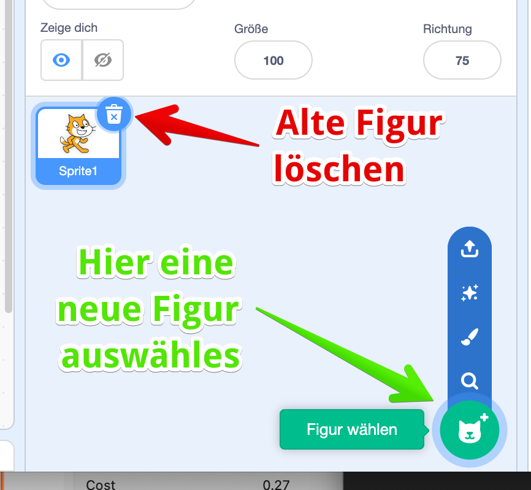
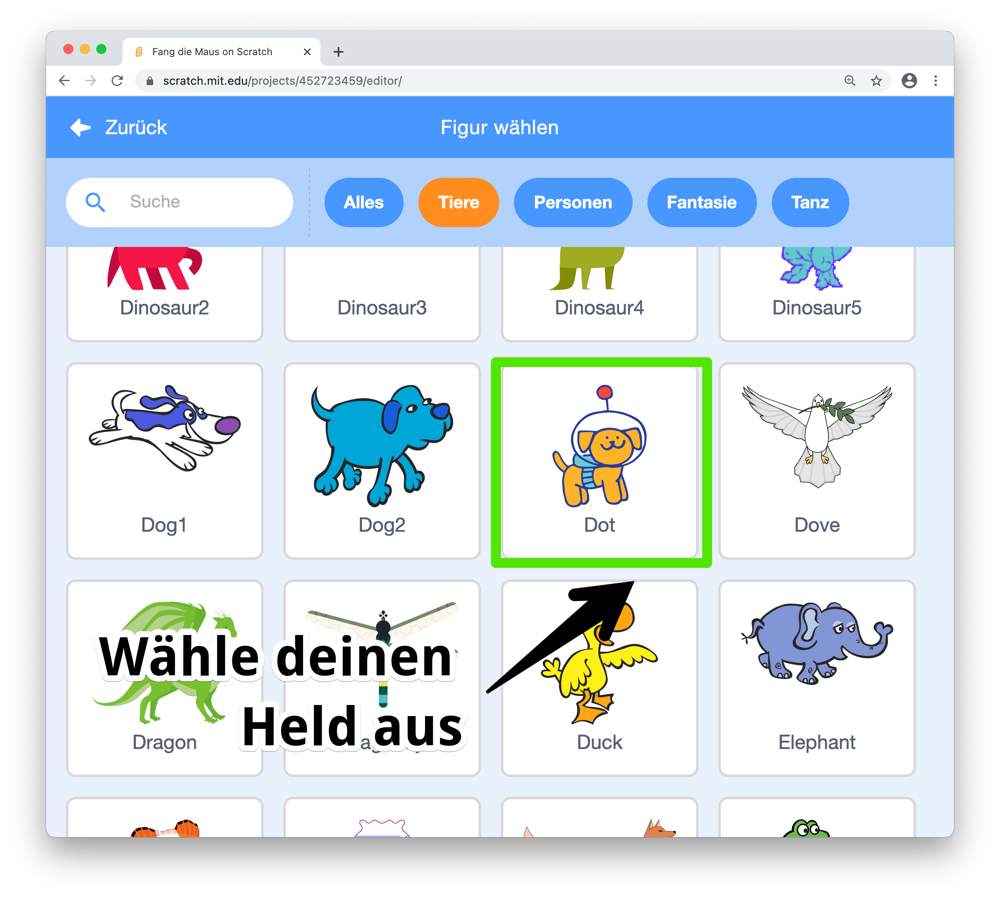
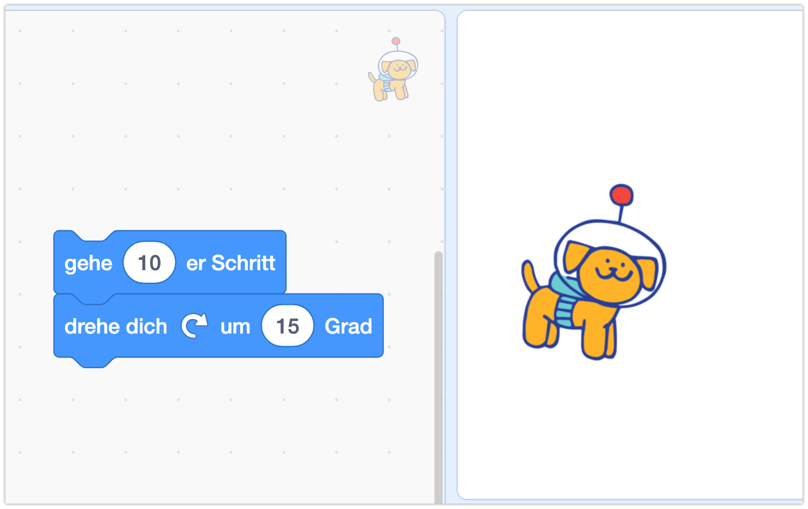
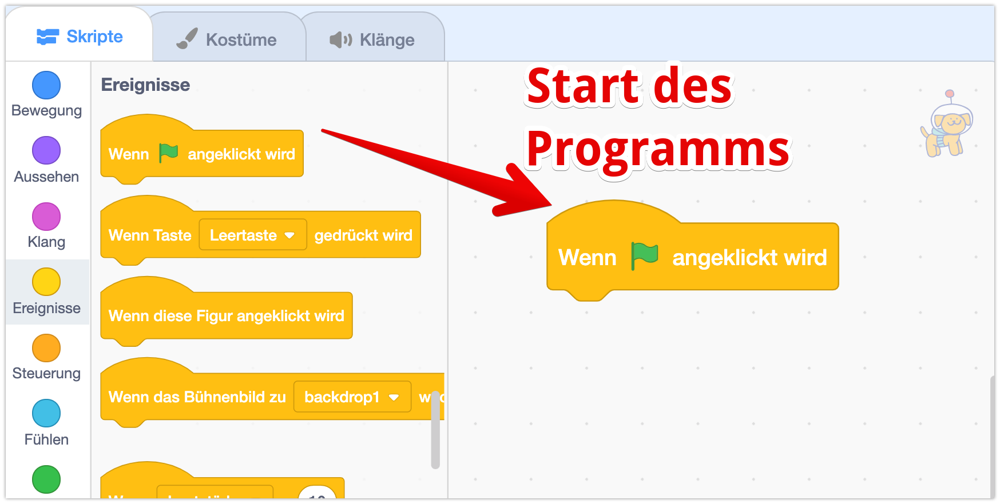
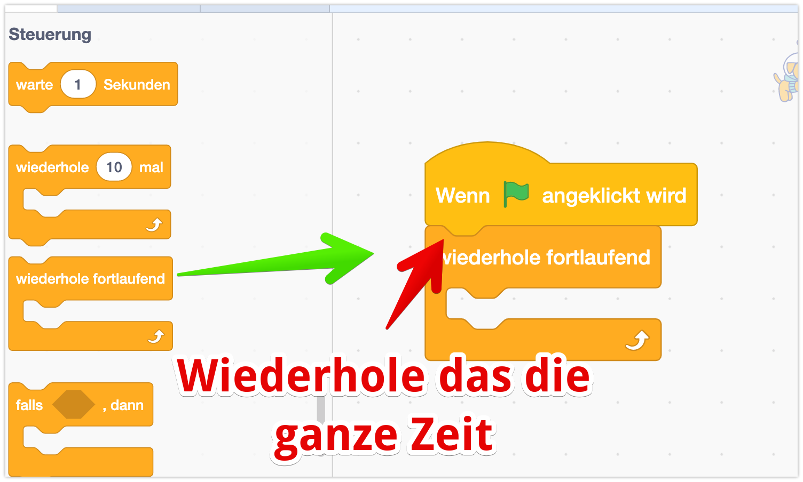
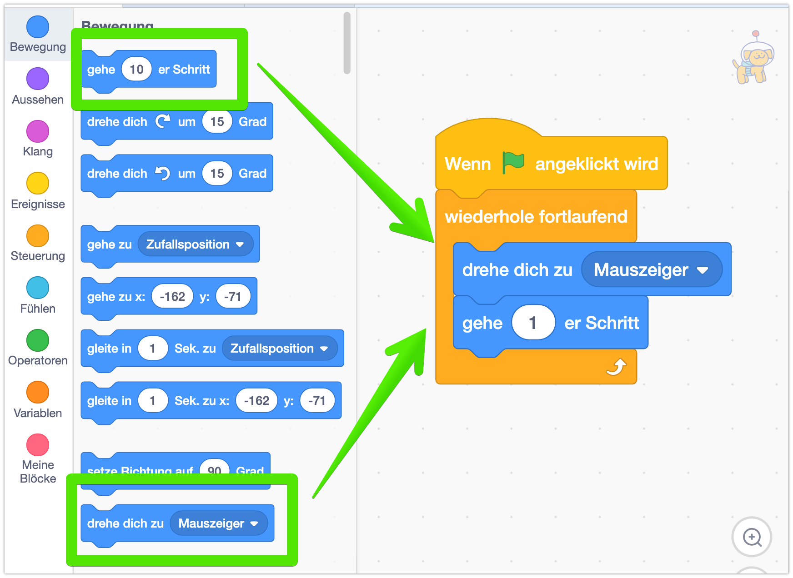
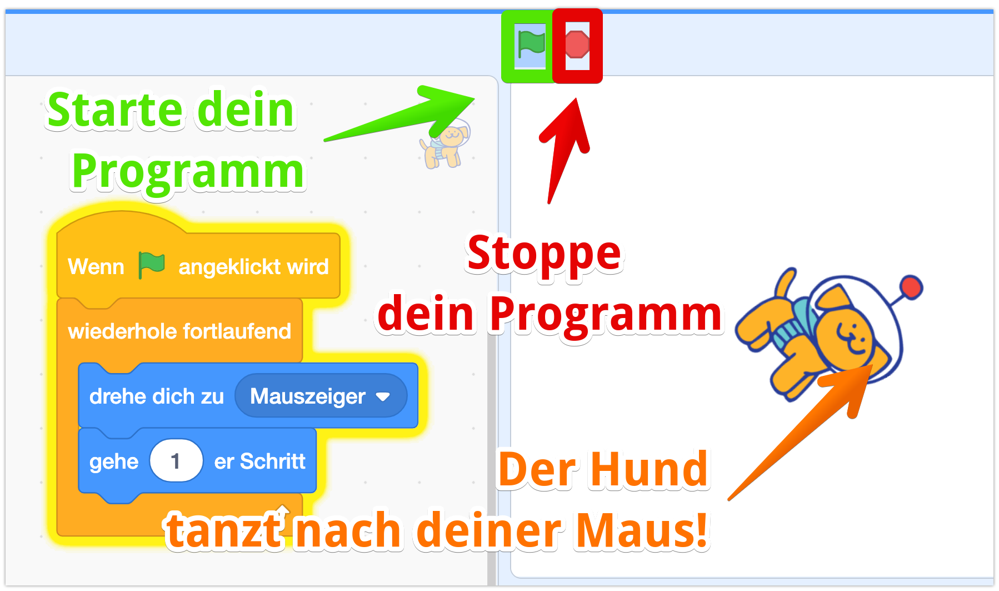

## Neue Figur anlegen

Wir starten und erstellen deinen “Helden”.

Dazu erstellst Du eine neue Figur. Mit dem Abfalleimer bei der bestehenden Figur kannst Du diese erst mal löschen. Dann klicke unten auf die “Katze +” - hier kannst Du auswählen, wie Du die neue Figur erstellen willst:

Für die erste Figur wählst Du am besten einen bestehenden Charakter aus, klicke auf die Lupe und Du erhältst eine lange Liste von vorgefertigten Figuren. Ich habe mir den Hund “Spot” ausgewählt - Du kannst Dir natürlich deine passende Figur auswählen.

## Wir hauchen der Figur Leben ein: Programmieren!

Bis jetzt steht unser Hund ja nur in der Gegend rum - im nächsten Schritt hauchen wir im Leben ein: wir programmieren ihn!

Klicke dazu auf der ganz rechten Seite auf den blauen Bereich `Bewegung` und ziehe mal die Befehle `gehe 10er Schritt` und `drehe dich um 15 Grad` und den Programmierbereich.   

Klicke mal auf die beiden Blöcke - der Held geht jeweils ein bisschen vorwärts und dreht sich! Aber das macht er ja nur einmal.

## Immer wieder: eine Schleife!

Damit ein echtes Programm draus wird, brauchen wir noch ein paar weitere Blöcke.


Der Block `Wenn Fahne angeklickt` ist bei den meisten Programmen und Figuren der Standard-Anfang für dein Programm! Merke ihn Dir gut! 


Und schon gehts weiter - wir holen uns den `wiederhole fortlaufend`-Befehl. Damit sagen wir der Figur, dass sie einen Befehl immer wiederholen soll. 

## ... dreh Dich!

Und der Befehl ist `drehe dich zum Mauszeiger` und `gehe 1er Schritt`.   


Du kannst auch eine andere Zahl als `1` in das Feld schreiben - probiert mal aus! 


## Das fertige Programm

Fertig ist dein erstes Programm! 

Um es zu starten - klicke auf die grüne Fahne - bewege Deine Maus und lass den Hund nach deiner Maus tanzen :)

