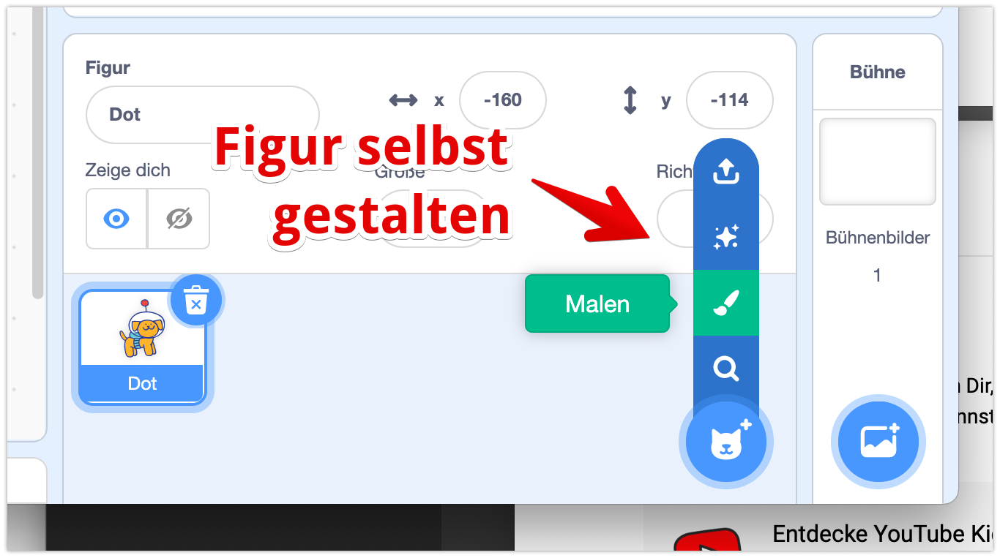
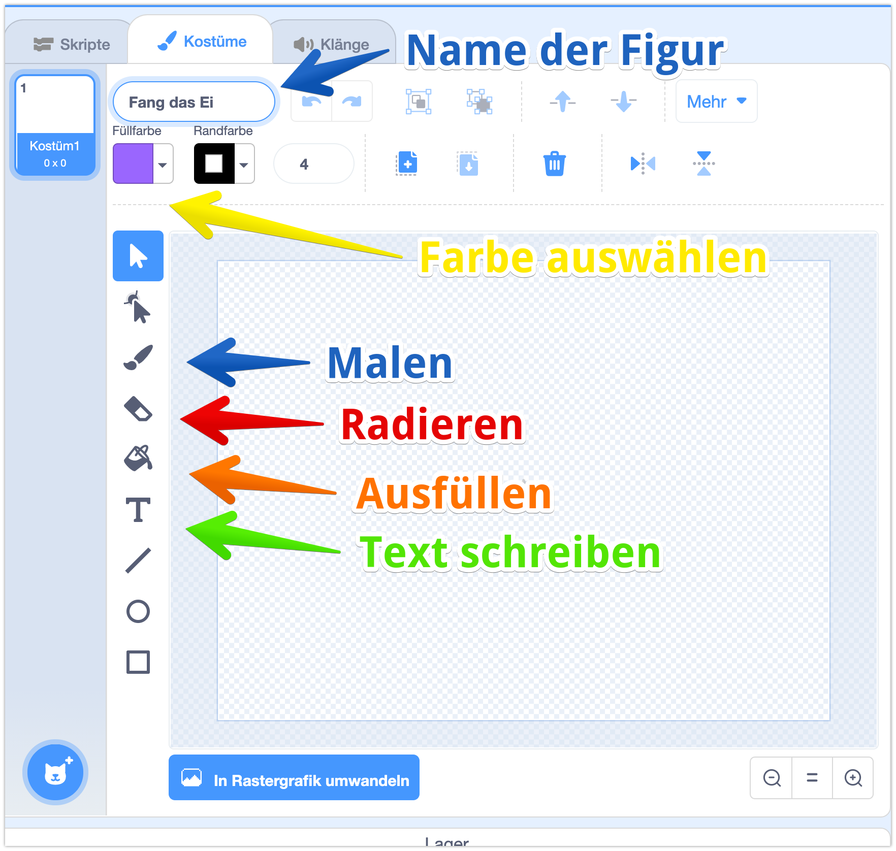
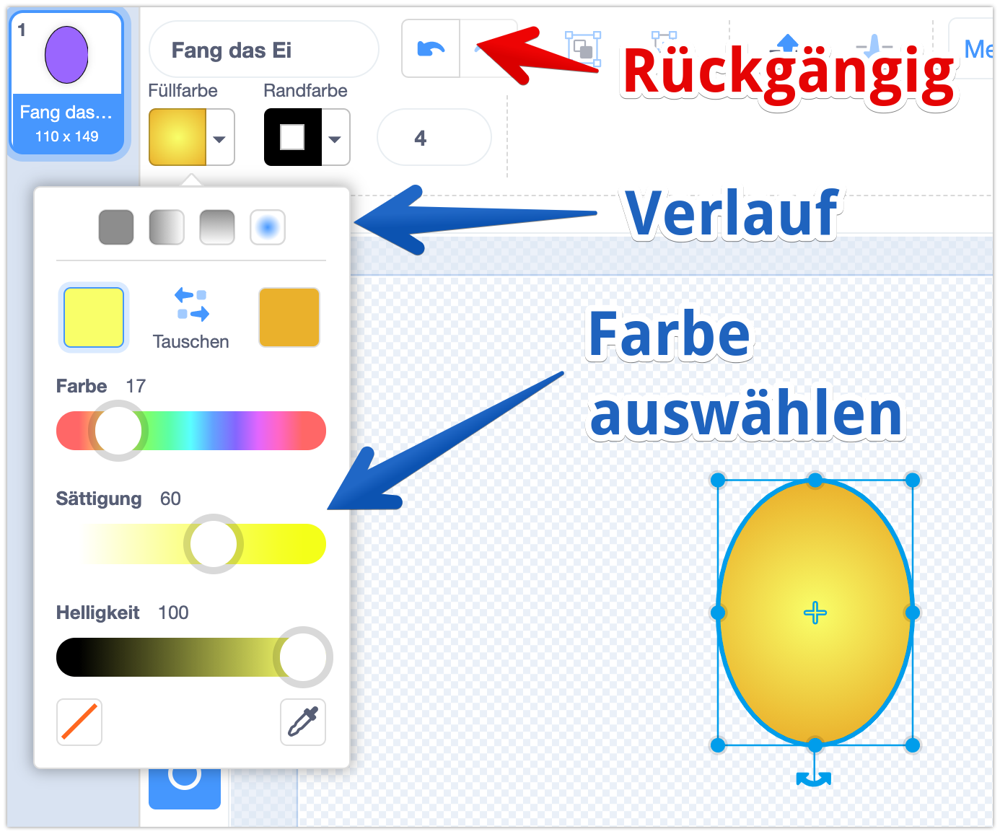
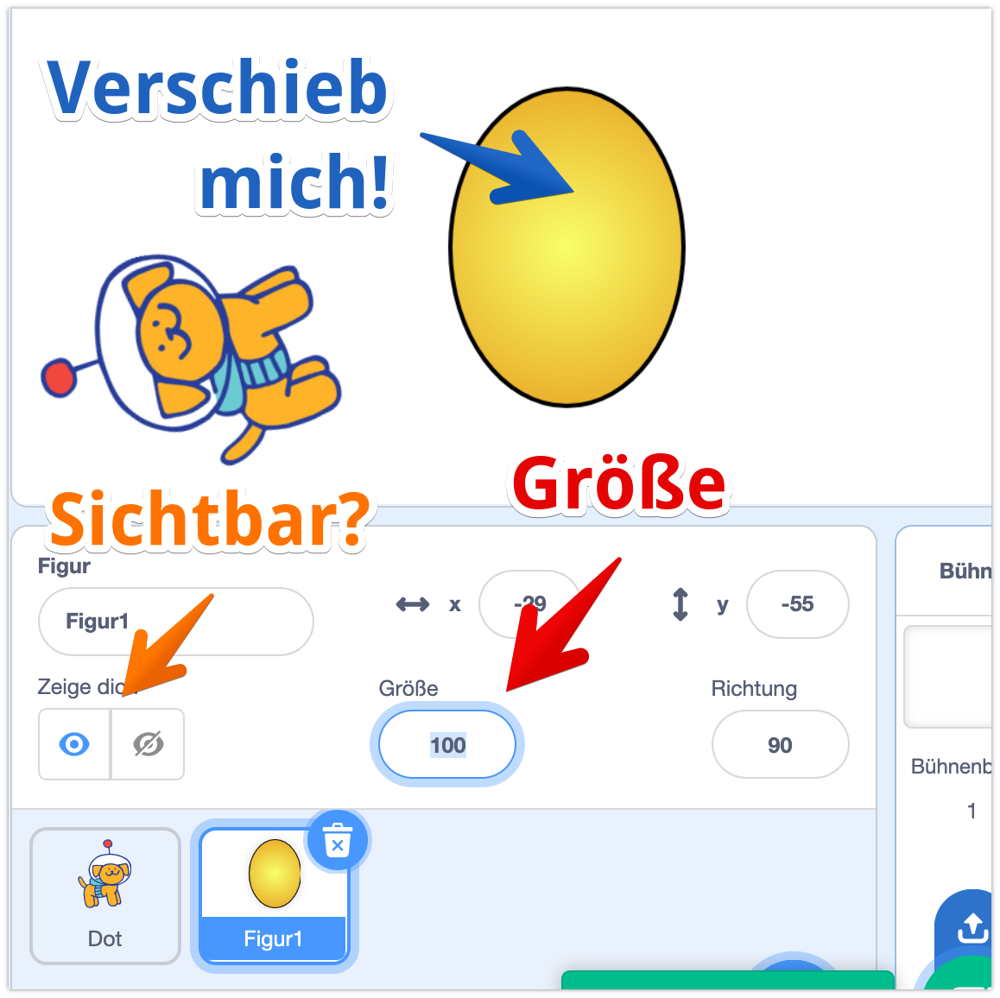
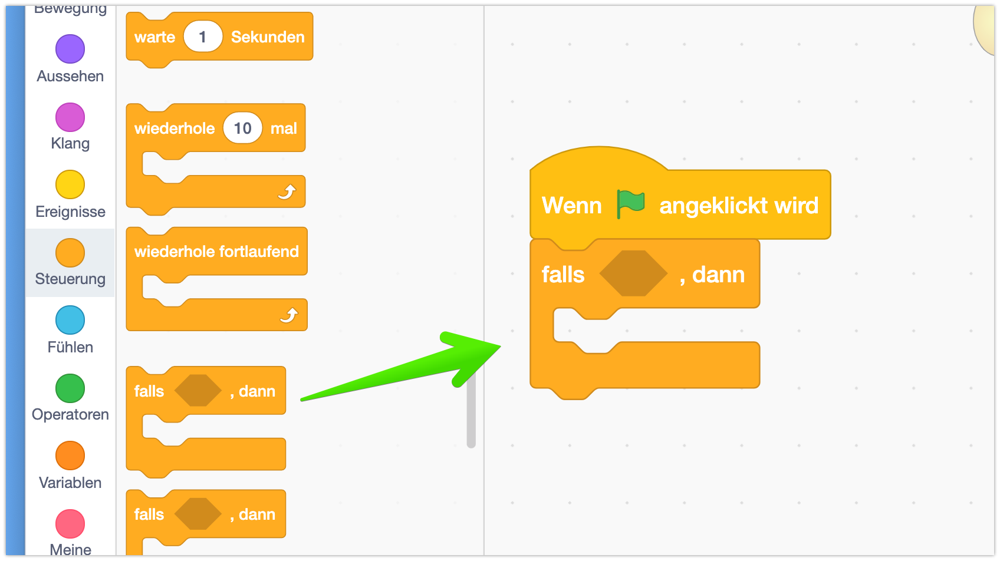
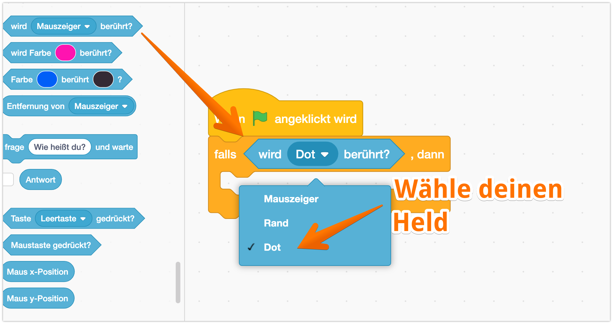
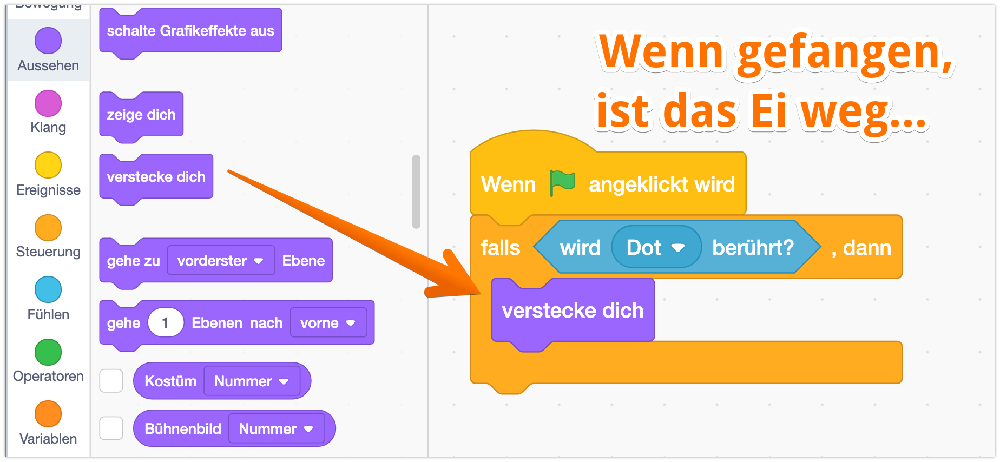
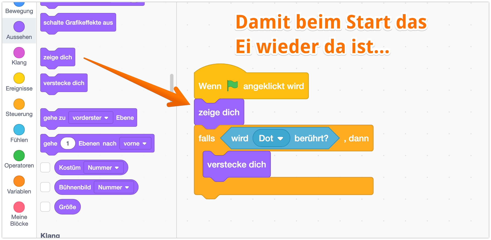
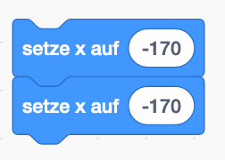
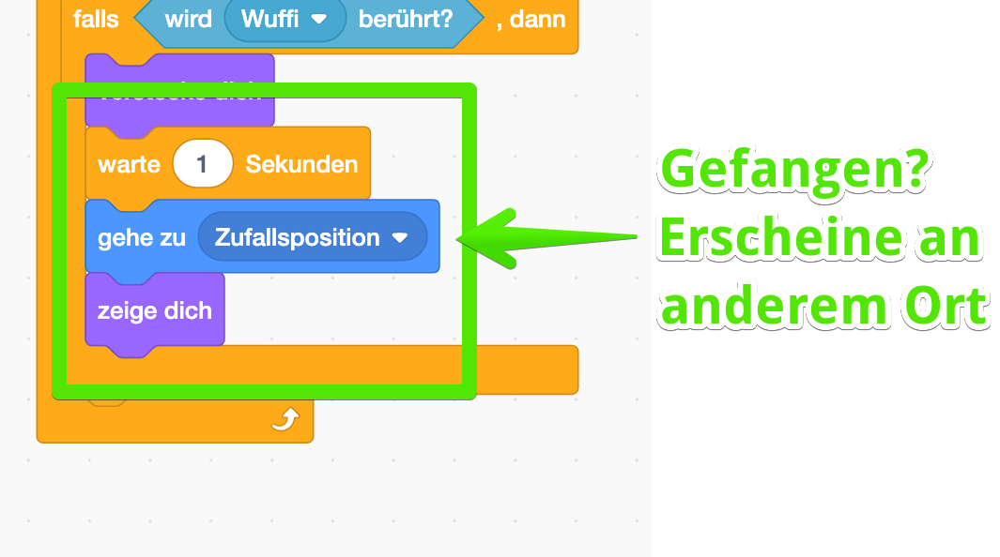

## Was zum Essen für unseren Held...

Bisher läuft er ja nur planlos in der Gegend rum - der kleine Hund bekommt natürlich sehr schnell Hunger. Wir geben im also was zum kauen: er liebt Eier!

Ziel des Spiels ist es, dass unser Hund so viele Eier wie möglich sammelt.

## Eier anlegen

Die Eier werden auch als *Figur* angelegt.
Dazu erstellst Du als erstes eine neue Figur, diesmal malen wir die Figur aber selber, also wählst du  `Malen`:

Jetzt öffnet sich ein neue Bereich: Auf der rechten Seite kannst Du die neue Figur nun gestalten.


Über dem Mal-Bereich siehst du 3 "Reiter" (so Knöpfe...) mit der Beschriftung `Skripte`, `Kostüme` und `Klänge`. Damit kannst Du zwischen dem Programmieren und Malen Deiner Figur wechseln.   


Ich male mein Ei jetzt:

- Zuerst male ich eine Elipse (Kreis) den Umriss des Eis
- Über die Auswahl "Füllfarbe" kannst du nun die Farbe auswählen

Oben gibt es verschiede Optionen - ich habe "Verlauf" gewählt.
Damit kann man 2 Farben wählen - damit erzeuge ich den plastischen Effekt beim Ei.


Du kannst natürlich das Ei gestalten wie du willst, oder auch ganz andere Sachen außer einem Ei nehmen.


Jetzt ist das Ei gemalt, und wir schauen uns mal die Eigenschaften der neuen Figur an:

## Eigenschaften der neuen Figur



Profi-Tipp: Als erstes gleich mal einen vernünftigen Namen für die Figur wählen! Das macht Dir die Arbeit später viel einfacher. Den Namen kannst Du direkt im dem Feld unter `Figur` ändern. Ich nenne meinen Hund mal **Wuffi** 



- Probiere doch jetzt mal aus, die Figur sichtbar und unsichtbar zu machen! Das geht mit dem `Auge`
- Meine Figur ist noch zu groß - über die Eigenschaft `Größe` kannst Du sie kleiner machen. 30 Ist bei mir genauch richtig.

# Programmierung des Futters

Ich möchte jetzte, dass das Ei verschwindet, wenn es von meiner Spielfigur eingesammelt wird. 
Hm, wie geht das jetzt am besten?

Dazu nutzen wir einen:

## Bedingungen: Falls-Dann Block

Mit dem `Falls-Dann` Block, den du bei dem Bereich `Steuerung` (Orange) findest, kannst du bestimmten Programmcode nur unter einen bestimmten Bediengung ausführen:

Und die Bedingung ist, dass das Ei eben Dot, meine Hauptfigur berührt.
Das kann das Ei "fühlen" - über den `Block wird .... berührt` - der ist unter der Kategorie `Fühlen`

Probier es mal aus! Lass Wuffi mal ein Ei essen!


Oops - einmal hat geklappt! Aber beim erneuten Start des Programms ist das Ei immer noch verschwunden! Das beheben wir gleich im nächsten Schritt!


## Initialisierung = Am Anfang alles richtig einstellen

Natürlich könntest Du jetzt hergehen und nach jedem Start manuell auf das `Auge` klicken, um das Ei wieder sichtbar zu machen. Aber ja ganz schön aufwendig! 

Es gibt eine einfachere und bessere Lösung: wir "initialisieren" unser Objekt! Dazu schreiben wir ganz oben im Programm - **vor der Schleife** - alle Eigenschaften rein, die am Start wichtig sind:

Du kannst hier auch die Befehle `setze X/Y auf` benutzen, damit das Ei immer an der gleichen Position startet. 

## Mehr Futter für unseren Hund!

Nach einem läppischen Ei ist unser Hund natürlich noch nicht satt - und das Spiel wäre ja auch langweilig. Drum gibts gleich mehr Eier für Wuffi! 

Nach dem `verstecken` lassen wir unser Ei einfach zu einer zufälligen Position gehen und sich mit `zeige dich` wieder erscheinen!  

