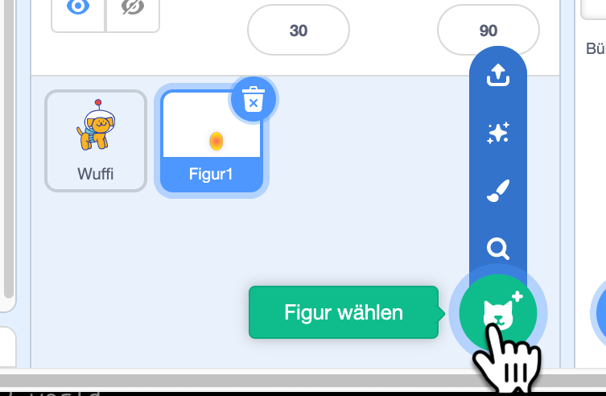
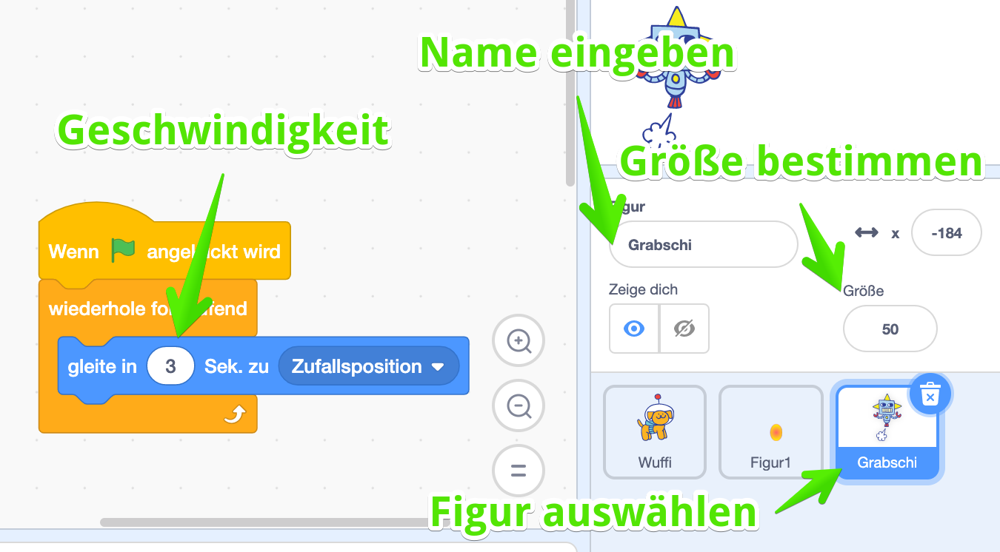
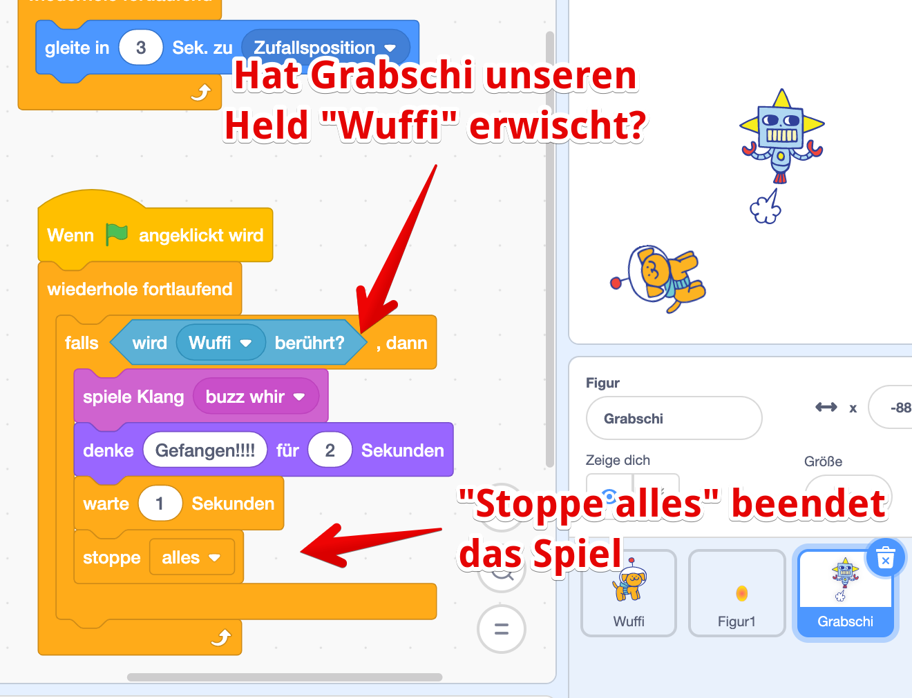

Nur futtern ist auf Dauer langweilig! Unser Wuffi bekommt jetzt noch einen Gegner, dem er ausweichen muss. Damit starten wir unser Level 3!

## Neue Figur erstellen

Ich erstelle alle eine neue Figur - unseren Gegner. Du kannst gerne einen eigenen Gegner malen, ich war faul und habe mir einen vorgefertigten Gegner geholt, einen fiesen Roboter!

Den habe ich **Grabschi** genannt!

Der soll auch durch die Gegend fliegen - aber automatisch. Dazu eignet sich der Befehl `gleite in 3 Sekunden zu Zufallpsosition` gut! 


Vergiss den `wiederhole fortlaufend`-Befehl nicht! Das ist die Schleife, damit er das die ganze Zeit macht!


## Bei Berührung - game over!

Aber bisher fliegt der zwar rum, aber nichts passiert. Wie könntest Du das jetzt programmieren? 

Genau - wir hatten ja schon was ähnliches bei den Eiern - die verschwinden ja, wenn sie von *Wuffi* berührt werden, beim Gegner machen wir was ganz ähnliches - wenn der den Wuffi berührt, ist das Spiel zu ende!


**Geschafft!** Der erste Teil deines Spiels ist fertig - Du hast einen 

