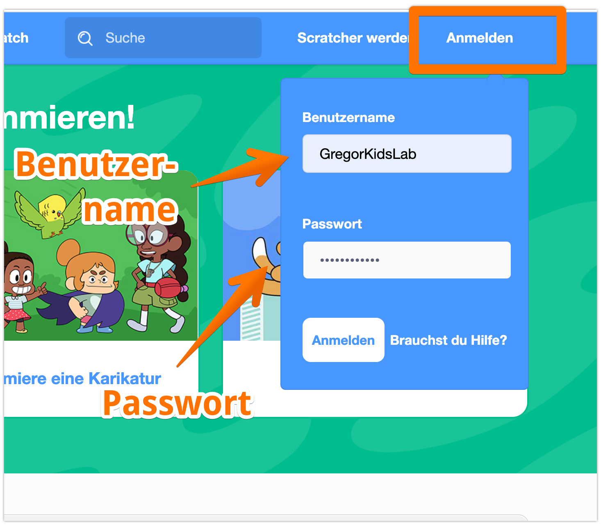

- Gehe auf die Website [scratch.mit.edu](https://scratch.mit.edu)
- und klicke auf "Anmelden"

> Entweder du meldest Dich selsbt an - oder, wenn Du an einem Kurs teilnimmst, hast du einen einen Benutzernamen und das Passwort per eMail erhalten. Dann trittst du direkt einer Klasse bei.

Nach der Eingabe gelangst Du zu foldendem Bildschirm: 

Im nächsten Schritt musst Du Dir ein eigenes Passwort auswählen. 

> Schreibe Dir Dein Passwort am besten auf, wenn du es Dir nicht merken kannst!

Jetzt wählst Du dein Land aus und gibst an, wie alt Du bist.

> Wenn du "**Deutschland**" nicht findest, suche nach "**Germany**"

Hurra - Du hast es geschafft - es kann losgehen!

